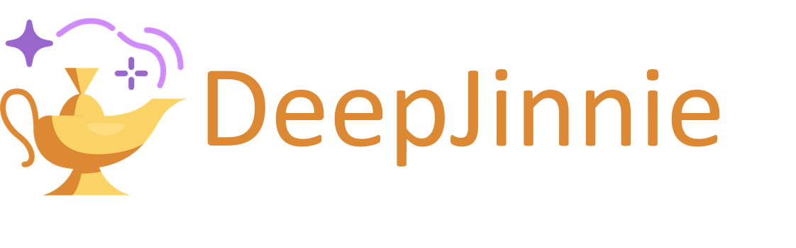

<h1 align="center"> Project DeepJinnie </h1>

`DeepJinnie` is the easiest way to find the answers you seek online. 

**Why is it called DeepJinnie?**
---

DeepJinnie comes from the word Jinn, which is the non anglicized version of genies. The internet is like a wise genie that holds all answers, but you need to ask your questions precisely and correctly in order to obtain them.  

**Running Details**
---

+ [@shobrook](https://www.github.com/shobrook) for logo and UI design assistance.
+ Base logo vector made by [Freepik](https://www.freepik.com/) from [Flaticon](www.flaticon.com).
+ [drduh's macOS-Security-and-Privacy-Guide](https://github.com/drduh/macOS-Security-and-Privacy-Guide) and [Jonathan Levin's MacOS Security Guide](http://newosxbook.com/files/moxii3/AppendixA.pdf) were incredibly helpful while I was building `stronghold`.

**Authors**
---

+ Carlo di Francescantonio
+ David Salazar
+ Liseth Grosso
